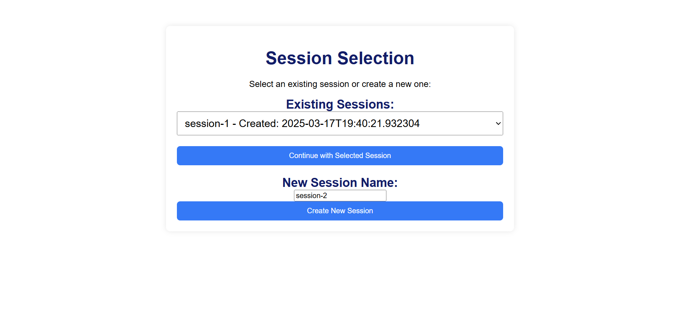
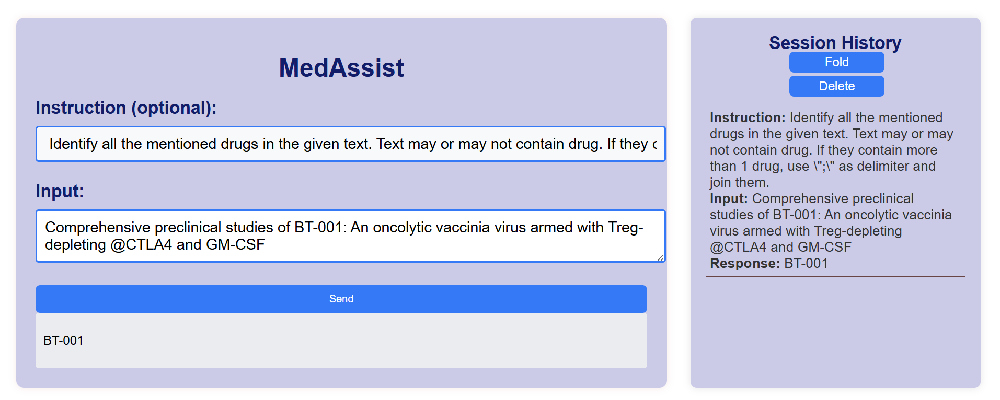

# MedAssist: Advanced Medical Chatbot

## Overview

MedAssist is an advanced medical chatbot built using a fine-tuned Hugging Face Transformer model (FLAN-T5 Small) integrated with LangChain and Retrieval-Augmented Generation (RAG) via FAISS. It provides context-aware medical responses using a web-based interface developed with Flask.

## Key Technologies Used

* **Hugging Face Transformers (FLAN-T5):**
  * Fine-tuned Transformer architecture providing accurate text-generation tailored for medical advice.
  * Layer-freezing and LoRA optimization techniques applied for efficient training.
* **Retrieval-Augmented Generation (RAG):**
  * LangChain integration to manage retrieval and context injection seamlessly.
  * FAISS vector database indexing for efficient similarity searches, enabling responses grounded in verified medical information.
* **Flask Web Framework:**
  * Interactive and user-friendly web interface with customizable session management.
  * Session-specific chat history tracking using SQLite.

## Features

* **Contextual Medical Advice:** Combines model-generated content with retrieved medical guidelines from vector indexes for reliable responses.
* **Session Management:** Users can create and manage multiple named chat sessions, preserving separate chat histories.
* **Robust Logging:** Comprehensive logging mechanisms across training, inference, and user interactions for efficient debugging and analytics.
* **Scalable and Efficient Training:** Customizable training with options for selective layer freezing and parameter-efficient fine-tuning (LoRA).

## Project Structure

```
Advanced Chatbot/
├── custom_logging/
│   └── logger.py
├── data/
│   ├── training_dataset.json
│   └── data_handler.py
├── database/
│   ├── chat_history_db.py
│   └── session_db.py
├── docker/
│   └── Dockerfile
├── faiss_index/
│   └── index.faiss
├── faiss_index_with_instruction/
│   └── index_instruction.faiss
├── fine_tuned_model/
│   ├── config.json
│   └── tokenizer_config.json
├── history/
│   └── chat_history.py
├── inference_optional/
│   └── llm_wrapper.py
├── interface_app/
│   ├── app.py
│   ├── static/
│   │   ├── css/
│   │   └── images/
│   └── templates/
│       ├── index.html
│       └── session.html
├── langchain_integration/
│   ├── rag_pipeline.py
├── logs/
│   ├── training_log/
│   ├── evaluation_log/
│   ├── rag_integration_log/
│   ├── vector_base_log/
│   └── langchain_integration_log/
├── Strict_Retrieval_Only_Approach/
│   └── app.py
├── training/
│   ├── fine_tuning.py
│   └── hyperparameter_tunning.py
├── vectorstore/
│   └── build_faiss_index.py
├── .gitignore
├── chat_history.db
├── session_history.db
├── config.yaml
├── README.md
└── requirements.txt

```

## Installation

```
# Clone the repository
git clone <repo-url>

# Install required packages
pip install -r requirements.txt

# Create and initialize FAISS index
python vectorstore/build_faiss_index.py

# Train the model
python training/fine_tuning.py

# Run the Flask web app
python interface_app/app.py
```

## Usage Guide

* **Creating Sessions:**
  * Choose an existing session or create a named new session.
* **Asking Medical Queries:**
  * Enter your queries clearly; the system returns context-aware medical advice.
* **Managing Sessions:**
  * Review chat histories for each session separately.
  * Clear session-specific chat history as required.

## Logging & Error Handling

Detailed logs are generated for:

* Model Training
* Model Evaluation
* RAG Interactions
* Web Interface Usage

Logs are stored systematically for effective debugging and performance tracking.

## Result




